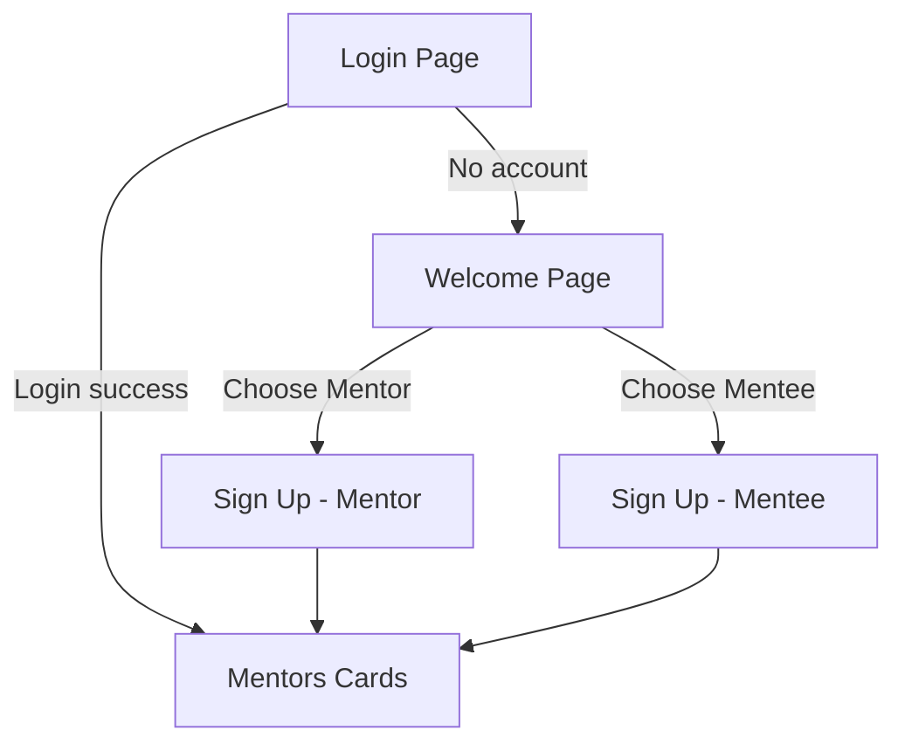

# Frontend Architecture & Style Guide

This document captures the coding style, structure, and page flow for the Mentor/Mentee project. It is based on your current snippets and standard React + MUI practices. The emphasis is on **many small components** and keeping **`App.jsx` (or `App.js`) as simple as possible**.

---

## 1) Coding Style Principles

- **Functional Components + Hooks** only (no class components).
- **Small, focused components** (single responsibility). Break UI into tiny, reusable pieces.
- **Props-first design**: pass data and callbacks down; keep components presentational when possible.
- **State placement**: keep state as close as possible to where it’s used. Lift state up only when multiple children need it.
- **Side effects**: colocate `useEffect` with the component that owns the state. Avoid global side effects.
- **Naming**
  - Components: `PascalCase` (e.g., `MentorCard`, `SearchBar`).
  - Files & folders: match component names (one component per file where possible).
  - Handlers: prefix with `handle` (e.g., `handleSearchClick`).
- **Styling**: Prefer MUI `sx` prop or theme-based styles. Keep inline styles minimal and consistent.
- **Data fetching**: isolate API calls in a **service layer** (e.g., `services/mentorApi.js`). Components call services, not `fetch/axios` directly.
- **Error & loading**: always model and render explicit states (`isLoading`, `error`).
- **Accessibility**: use semantic elements, ARIA where needed, proper button roles, focus traps in dialogs, and keyboard navigation.
- **Type safety**: add `PropTypes` (or TypeScript) for all exposed components.
- **Testing**: write unit tests for logic and rendering of small components first.

---

## 2) App Shell: Keep `App.jsx` Simple

**What belongs in `App.jsx`**
- App-wide providers (ThemeProvider, Router, QueryClientProvider if used).
- Route table: only `Routes`/`Route` elements mapping to page-level components.

**What does *not* belong in `App.jsx`**
- No business logic, no data fetching, no page-specific state.
- No large layout logic. Use a `Layout` component for nav/app bars.

**Example skeleton:**
```jsx
function App() {
  return (
    <ThemeProvider theme={theme}>
      <CssBaseline />
      <Router>
        <Routes>
          <Route element={<MainLayout />}>
            <Route path="/" element={<LoginPage />} />
            <Route path="/welcome" element={<WelcomePage />} />
            <Route path="/signup/mentor" element={<SignUpMentorPage />} />
            <Route path="/signup/mentee" element={<SignUpMenteePage />} />
            <Route path="/mentors" element={<MentorsPage />} />
          </Route>
        </Routes>
      </Router>
    </ThemeProvider>
  );
}
```

---

## 3) Project Structure (suggested)

```
src/
  components/
    common/
      SearchBar/
        index.jsx
        styles.js
      Dialog/
        MentorDialog.jsx
    mentor/
      MentorCard/
        index.jsx
      MentorContactCard/
        index.jsx
      parts/
        MentorFullName.jsx
        MentorTechnologies.jsx
    layout/
      MainLayout.jsx (AppBar/Toolbar/Outlet)
  pages/
    LoginPage/
      index.jsx
    WelcomePage/
      index.jsx
    SignUp/
      Mentor/
        index.jsx
      Mentee/
        index.jsx
    MentorsPage/
      index.jsx   // shows AllMentorsCards
  services/
    http.js       // axios base instance
    userApi.js
    mentorApi.js
  hooks/
    useTheme.js
  theme/
    index.js
  App.jsx
  main.jsx
```

**Guidelines**
- Each folder exports a single default component via `index.jsx`.
- Keep **“parts/”** for tiny subcomponents (labels, chips, typography blocks).
- Avoid deep nesting beyond 3–4 levels.

---

## 4) Componentization Rules (Small > Big)

- **Pages**: orchestration only (data fetch via services, wire up local state, render composition of smaller components).
- **Containers** (optional): data-fetch + state mgmt for a specific feature.
- **Presentational components**: props in, events out. No data fetching.
- **Split early** when a component:
  - grows beyond ~200 lines, or
  - renders visually distinct sections, or
  - accepts too many props (consider composing smaller ones).

---

## 5) Data & API Layer

- Create a shared `axios` instance in `services/http.js`.
- In `mentorApi.js` and `userApi.js`, expose functions like `getMentors()`, `searchMentors(params)`, `getUsers()`, etc.
- Pages call **only** these service functions. No raw `fetch/axios` inside components.
- Optional: introduce React Query for caching, loading/error states, and invalidation.

**Example service:**
```js
// services/mentorApi.js
import http from './http';
export const getMentors = () => http.get('/api/mentors');
export const searchMentors = (q) => http.get('/api/mentors', { params: q });
```

---

## 6) UI Patterns (MUI)

- Use `sx` for quick, consistent styling; centralize colors/spacing in the theme.
- Reuse small typography components (e.g., `MentorFullName`, `MentorTechnologies`).
- **Dialogs**: focus-lock, `onClose` always provided, escape/overlay close enabled.
- **Lists/Cards**: small, clickable cards open detail dialog.

---

## 7) Routing & Page Flow (End Goal)

### Flow Diagram


### Route Table

| Route | Page Component | Description |
|---|---|---|
| `/` | `LoginPage` | Default entry. Authenticates user. On success → `/mentors`. |
| `/welcome` | `WelcomePage` | Choose **Mentor** or **Mentee**. If not signed up, go to the appropriate sign-up page. |
| `/signup/mentor` | `SignUpMentorPage` | Create mentor profile. On success → `/mentors`. |
| `/signup/mentee` | `SignUpMenteePage` | Create mentee profile. On success → `/mentors`. |
| `/mentors` | `MentorsPage` | Displays mentors grid with search & filters (Mentor Cards + Dialog). |

---

## 8) Pages: Responsibilities & Composition

### `LoginPage`
- Minimal form (email/password or SSO button).
- On success, if user already has a profile → `/mentors`; else → `/welcome`.

### `WelcomePage`
- Two buttons/cards: **I’m a Mentor** / **I’m a Mentee**.
- If profile exists, skip sign-up and go to `/mentors`; otherwise route to corresponding sign-up page.

### `SignUpMentorPage` / `SignUpMenteePage`
- Controlled form components (small inputs/selects per field).
- Client-side validation; show errors inline.
- Submit → create profile → route to `/mentors`.

### `MentorsPage`
- Composition: `SearchBar` + `AllMentorsCards` + `MentorCard` + `MentorDialog`.
- Fetch mentors via `mentorApi.getMentors()`; pass data down as props.
- Search/filter delegates to service; keep UI responsive with loading/empty states.

---

## 9) Reusable Building Blocks (Examples)

- `SearchBar` → stateless; emits `onSearch(params)`.
- `MentorCard` → minimal fields; opens `MentorDialog` on click.
- `MentorDialog` → wraps `MentorContactCard` (full profile + actions).
- `parts/` → tiny display components like `MentorFullName`, `MentorTechnologies`.

---

## 10) Conventions & Quality

- **Imports**: absolute paths with `@/` alias (configure Vite/CRA accordingly).
- **Empty states**: always render friendly messages when lists are empty.
- **Form UX**: disable submit while invalid; show helper texts.
- **Performance**: memoize heavy lists; keys for lists; avoid anonymous inline functions in hot paths.
- **Commits**: Conventional Commits (`feat:`, `fix:`, `refactor:`...).

---

## 11) Next Steps Checklist

- [ ] Create `services/http.js` + `mentorApi.js` + `userApi.js`.
- [ ] Split current big pieces into smaller `parts/` where applicable.
- [ ] Create `MainLayout` (AppBar/Shell) and move nav out of pages.
- [ ] Implement the routes from the table.
- [ ] Build `LoginPage`, `WelcomePage`, `SignUpMentorPage`, `SignUpMenteePage`, `MentorsPage` following the flow.
- [ ] Add PropTypes to all public components (or migrate to TypeScript).
- [ ] Add loading/error/empty states to mentor list & search.
- [ ] Add basic tests for SearchBar, MentorCard, and routing.

